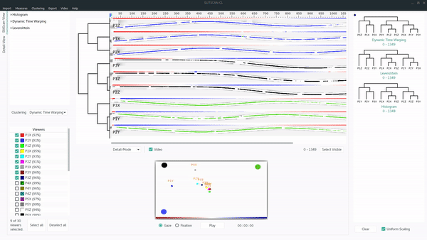

# eye-slitscan

# Description
A visual analytics tool especially suitable for analyzing eye tracking data generated from dynamic stimuli.
Gaze data of multiple viewers can be visualized and compared using the so called (gaze-guided) slit-scan technique. In the slit scan technique, individual strips of a visual stimulus are cut out and joined together along a timeline. The result is a compact and easily interpretable representation of the gaze behavior of a person. 
For more information about this technique, we refer to this publication:

Kurzhals, Kuno, and Daniel Weiskopf. "Visualizing eye tracking data with gaze-guided slit-scans." Eye Tracking and Visualization (ETVIS), IEEE Second Workshop on. IEEE, 2016.

# Key Features

* Visualization of gaze data based on the **(gaze-guided) slit-scan technique**
and **gaze-replay**.
* Comparing gaze data with **similarity measures**.
* **Data-mining methods** and **auxiliary visual components** for better interpretation of similarity values.
* Comparing results of clustering based on **dendrogram similarity**.

# Installing

## Prerequisites

This tool run successfully on Arch-Linux and Ubuntu (Trusty Tahr) as well as on OSX (High Sierra).
Though it should work on Windows just as fine. You just have to make sure that the following 
libraries/frameworks are installed on your machine.

* Qt5 application framework. Please make sure that your Qt version contains the **Qt5Multimedia, Qt5MultimediaWidgets and Qt5Charts** modules.
* OpenCV library (version >= 3.0).

In addtion you need CMake (version >= 2.8) for cross-platform building.

## Building

Simply execute `cmake . && make` in the root directory of this project. If the build process succeeded, you can 
find the exectuable in the `gui/` folder.

# License
eye-slitscan is released under the MIT-License

Copyright 2017-2018, Maurice Koch

Permission is hereby granted, free of charge, to any person obtaining a copy of this software and associated documentation files (the "Software"), to deal in the Software without restriction, including without limitation the rights to use, copy, modify, merge, publish, distribute, sublicense, and/or sell copies of the Software, and to permit persons to whom the Software is furnished to do so, subject to the following conditions:

The above copyright notice and this permission notice shall be included in all copies or substantial portions of the Software.

THE SOFTWARE IS PROVIDED "AS IS", WITHOUT WARRANTY OF ANY KIND, EXPRESS OR IMPLIED, INCLUDING BUT NOT LIMITED TO THE WARRANTIES OF MERCHANTABILITY, FITNESS FOR A PARTICULAR PURPOSE AND NONINFRINGEMENT. IN NO EVENT SHALL THE AUTHORS OR COPYRIGHT HOLDERS BE LIABLE FOR ANY CLAIM, DAMAGES OR OTHER LIABILITY, WHETHER IN AN ACTION OF CONTRACT, TORT OR OTHERWISE, ARISING FROM, OUT OF OR IN CONNECTION WITH THE SOFTWARE OR THE USE OR OTHER DEALINGS IN THE SOFTWARE.

# Credits
This software relies on the following third party projects.
* [Qt](https://github.com/qt) -  (C) 2015 The Qt Company Ltd.
* [OpenCV](https://github.com/opencv/opencv) - Copyright (C) 2000-2018, Multiple authors, all rights reserved.
* [QtOpenCV](https://github.com/dbzhang800/QtOpenCV.git) - Copyright (c) 2012-2015 Debao Zhang <hello@debao.me>
* [fast-cpp-csv-parser](https://github.com/ben-strasser/fast-cpp-csv-parser.git) - Copyright (c) 2015, ben-strasser
* [tinyxml2](https://github.com/leethomason/tinyxml2.git) - Original code by Lee Thomason www.grinninglizard.com

# Acknowledgement

This project emerged as a part of a bachelor thesis at the [Visualisation Research Centre (VISUS)](https://www.visus.uni-stuttgart.de/index.en.html) which is a central institution of the University of Stuttgart. Many thanks goes to Kuno Kurzhals for his great supervision.

